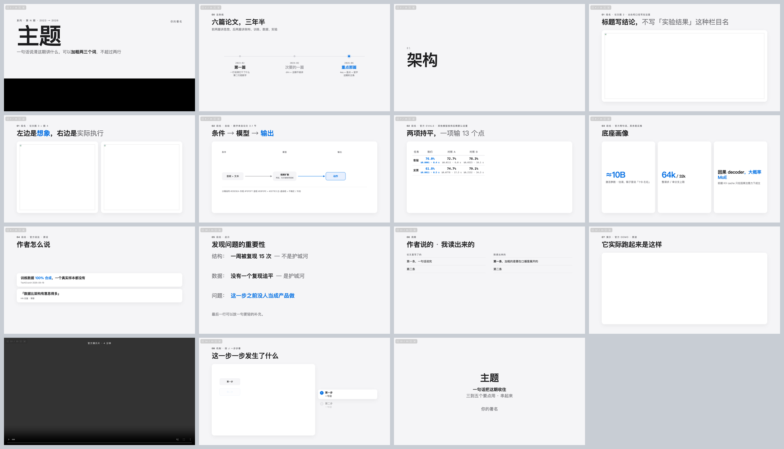

# kelip-slide

用**单个 HTML 文件**做讲解幻灯片：1920×1080，浅灰底 + 黑字 + 一个强调色，一页一张大图，
文字少、页不排满。Chrome 双击就能放，方向键翻页，断网可用，适合录屏讲解和技术分享。

这是一个 [Claude Code](https://claude.com/claude-code) skill——装上之后跟 Claude 说
「做一个讲 X 的 deck」，它就按这套版式给你搭。不用 Claude 也能用：
`assets/deck-template.html` 本身就是一份可以直接改的模板。



## 为什么是 HTML 不是 PPTX

- 录屏清晰，缩放不糊，字体不会因为换机器变形
- 机制图想画就画（内联 SVG），改数据不用回 Illustrator
- 视频直接嵌，翻到自动播、翻走自动停
- 改一行字不用重新导出，`git diff` 看得见改了什么
- 一个文件夹发给别人就能看，不装任何软件

## 安装

```bash
git clone https://github.com/skJack/kelip-slide.git ~/.claude/skills/kelip-slide
```

装完在 Claude Code 里敲 `/` 能看到 `kelip-slide`。不用 Claude 的话跳到
[手动用模板](#方式二手动用模板)。

---

## 用法

### 方式一：让 Claude 搭

装完直接说需求就行，它会自己找过来：

```
用 kelip-slide 做一个 deck，讲 XXX 论文，图在 ./paper/figures，我要讲 15 分钟
```

```
这个产品发布会的 deck 帮我搭一下，素材：官网截图在 ./shots，demo 视频 ./demo.mp4
```

改的时候直接说人话，不用提页号以外的术语：

```
第 7 页图太小            第 3 页拆成两页            把第 12 页换成自绘的流程图
整体换成深色             强调色换成橙色             加一页放这三个数字
```

它会做四件事：复制模板 → 逐页填 → **渲染成缩略图自己看一遍** → 把图给你确认。
最后你会拿到一个 `deck/` 文件夹：`deck.html` + `media/` + 一张全页预览。

想提高一次成型率，动手前先把这三样给它：**素材放哪**、**讲多久 / 多少页**、
**每段要讲什么**（一句话一段就够）。

### 方式二：手动用模板

```bash
mkdir -p mydeck/media && cd mydeck
cp ~/.claude/skills/kelip-slide/assets/deck-template.html deck.html
cp ~/.claude/skills/kelip-slide/assets/render_preview.py .
open deck.html          # Linux: xdg-open
```

模板里 15 种页型各有一个填好的示例页，按注释编号找（`<!-- ===== 4 一图页 ... -->`），
删掉用不上的，剩下的照着改。图片视频都放 `media/`，用相对路径引。

**一页的结构**固定是四件套，最常用的一图页长这样：

```html
<section class="slide" data-sec="02 架构" data-title="一份输入，三条分支">
  <div class="kicker"><b>02</b>架构 · 论文图 3 · 出处口径写这里</div>
  <h1>一份输入，<span class="thin">三条互不相见的分支</span></h1>
  <div class="fig card"></div>
</section>
```

- `data-sec` 是段名（左上角页面列表按它分组），`data-title` 是列表里显示的标题，**都要填**
- `.kicker` 放段号 + 段名 + 这页的出处；`<h1>` 写结论；`<span class="thin">` 压灰次要半句，
  `<span class="acc">` 点一个数字，一页最多点一处
- `.fig.card` 的白卡尺寸由 JS 按图片真实比例算，宽图不会上下留白——**别给它写死宽高**

放数字的页：

```html
<section class="slide" data-sec="03 规模" data-title="底座画像">
  <div class="kicker"><b>03</b>规模 · 官方公开数据</div>
  <h1>底座画像</h1>
  <div class="stats">
    <div class="stat"><div class="n">≈10B</div><div class="l">激活参数 · 估读</div></div>
    <div class="stat"><div class="n">64k<small>/ 32k</small></div><div class="l">整请求 / 单分支上限</div></div>
    <div class="stat text"><div class="n">因果 decoder<span class="acc">，大概率 MoE</span></div>
      <div class="l">前缀 KV cache 只在因果注意力下成立</div></div>
  </div>
</section>
```

其余页型（自绘 SVG、表、原话卡、视频页、分步动画……）照抄模板里对应的示例页。

### 排完一定要渲染出来看

版式对不对别靠脑补，逐页截图拼成一张缩略图看：

```bash
python3 render_preview.py deck.html 30 /tmp/deck-render 1
open /tmp/deck-render/contact.png
```

（`30` 是页数，最后的 `1` 是缩放倍数。需要 `pip install pillow` 和本机装了 Chrome，
路径不对就 `CHROME=/path/to/chrome python3 render_preview.py ...`）

重点看：图是不是顶到卡边、白卡是不是空了一半、表格有没有挤成一团、标题有没有压住图。
单页放大看 `/tmp/deck-render/slide-07.png`。

### 放映和录屏

`F` 进全屏，剩下的就是方向键。录屏把浏览器窗口调成 16:9（1920×1080 或 1280×720），
全屏后整页就是画面。视频页翻到就自动静音循环播，翻走自动暂停，不用手点。
临时要跳页就敲数字键，或者 `G` 打开左上角的页面列表点选。

### 键位

| 键 | 作用 |
|---|---|
| `→` `空格` `↓` / `←` `↑` | 翻页 |
| `Home` / `End` | 首页 / 末页 |
| 数字键 | 跳页（两位数连按） |
| `F` | 全屏 |
| `C` | 显示 / 隐藏页码 |
| `G` 或左上角 `☰` | 展开页面列表 |
| `J` / `K` | 分步动画页的下一步 / 上一步 |

鼠标点右侧 80% 下一页，左侧 20% 上一页。
地址栏 `deck.html#10` 直接开第 10 页，`?nav=1` 打开时展开列表，`?anim=3#22` 停在动画第 4 步。

---

## 里面有什么

| 文件 | 用途 |
|---|---|
| `SKILL.md` | 版式系统、15 种页型速查、自查回路、常见坑 |
| `assets/deck-template.html` | 模板：全部组件 CSS + 导航 JS + 每种页型一个示例页 |
| `assets/render_preview.py` | 逐页渲染成 PNG 并拼成缩略图 |
| `references/svg.md` | 自绘机制图：坐标系、配色字号表、四种画法、分步动画 |
| `references/media.md` | 素材处理：PDF 转图、裁白边拼图、切视频、网页截图 |
| `references/customize.md` | 改造：换配色 / 字体 / 画幅、加回页脚小字、导出 PDF |

页型：封面 · 时间线 · 过渡页 · 一图页 · 两图并排 · 自绘 SVG · 表 · 数字卡 · 原话卡 ·
大字页 · 两列清单 · 视频页 · 满屏播片 · 分步动画 · 收尾，外加图片网格、并排大卡、四步条、代码卡。

## 常见问题

**图不显示** — 路径要相对 `deck.html`（`media/x.png`），别用绝对路径；
文件名大小写在 macOS 上无所谓，传给别人可能就有所谓了。

**视频不自动播** — 必须有 `muted`，浏览器不允许带声音自动播放。

**字变成了衬线体** — SVG 里的 `<text>` 要挂在 `class="sv"` 的元素下面，
或者自己写 `font-family`。

**想要页脚出处小字 / 底部注释行** — 模板默认不放（留白优先），
`references/customize.md` 里有现成 CSS，加回来即可。

**想换画幅 / 配色 / 字体** — 同上，`references/customize.md`。换强调色只改
`:root` 里 `--accent` 一行。

**导出 PDF** — 用 `render_preview.py` 出单页 PNG 再合成（`img2pdf slide-*.png -o deck.pdf`），
比浏览器打印靠谱。

## 关于内容

版式是固定的，**内容规则不是**。`SKILL.md` 里标了「建议」的部分（标题写结论、一页一个点、
页数区间、默认不放页脚小字）都是从几十期实际做下来的默认值，按你自己的需要推翻就好——
项目里有自己的风格约定时，以你的约定为准。

## License

MIT。版式、模板、示例内容随便用，不用署名（当然你要提一句我也很高兴）。
